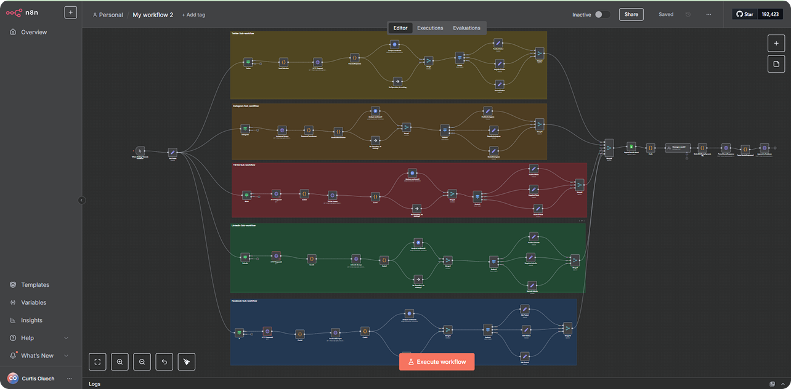
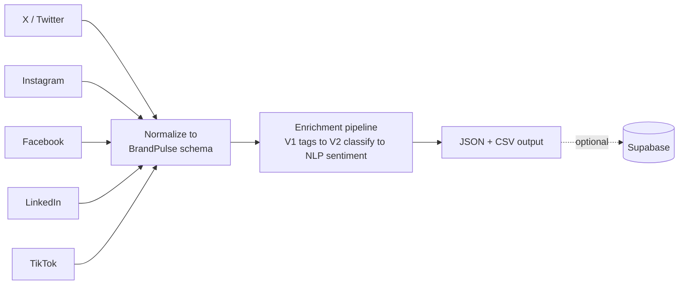

# BrandPulse

> Scrapes X, Instagram, Facebook, LinkedIn, and TikTok for public brand mentions, then runs them through a trilingual NLP pipeline tuned for Kenya's English/Swahili/Sheng code-switching.


**Status: paused.** Built as freelance/contract work; not currently under active development. Documented here as-is, including the rough edges found during this audit.

<p align="center">
  
</p>
<p align="center"><em>The five scrapers orchestrated as sub-workflows in n8n.</em></p>

Before this became Python, BrandPulse's MVP was built in n8n for one customer — the goal was to validate the idea and, more importantly, find out which fields the client actually needed out of a "brand mentions" feed that a low-code workflow tool couldn't reliably produce. Those gaps are what drove the move to hand-written Python scrapers: n8n proved the idea worked, but its off-the-shelf scraping nodes couldn't hit the field-level detail (geolocation fusion, trilingual sentiment, platform-specific schema fields) the client's use case needed.

## The problem

Brands operating in Kenya want to know what's actually being said about them across social media — not just on their own official pages, but in the wider public conversation — so they can refine marketing strategy and internal processes based on real sentiment. Kenyan social media conversation also code-switches heavily between English and Sheng (Nairobi's English-Swahili slang), which most off-the-shelf sentiment tooling handles poorly. BrandPulse was built to cover both problems: pull public mentions from five platforms at once, and score sentiment in the language the post was actually written in.

## What it does

- Scrapes keyword mentions and owned-account posts across **X, Instagram, Facebook, LinkedIn, and TikTok**
- Normalizes all five platforms' post data into one common schema (`caption`, `username`, `hashtags`, `comment_texts`, etc.)
- Runs posts through a 3-stage enrichment pipeline: product/intent/topic tagging → location/account/brand classification → sentiment
- Scores sentiment with a **hybrid trilingual NLP pipeline**: Google Cloud NLP for English, a locally-run HuggingFace AfriSenti model for Swahili/Sheng
- Fuses up to **8 independent signals** (caption text, hashtags, EXIF, posting time, username, optional Claude Vision image analysis, and more) into a confidence-scored location guess for Instagram posts with no native geotag
- Optionally pushes enriched results to Supabase

## How it works

Each platform has its own scraper (different auth, different anti-bot posture), but they all feed the same enrichment pipeline:



X is a hybrid: `twikit` handles login/session only, while the actual tweet discovery goes through Playwright. Instagram/Facebook/LinkedIn/TikTok all reuse one manually-logged-in Chrome profile rather than programmatic credentials. See [docs/architecture.md](docs/architecture.md) for the full per-platform breakdown, the NLP routing diagram, and the geolocation fusion detail.

## Stack

| Layer | Choice | Why |
|---|---|---|
| Browser automation | Playwright (primary); Selenium-shaped API on Instagram, shimmed onto Playwright mid-migration | No official API on any of these platforms covers "search all public posts by keyword" |
| X auth | `twikit` | Handles login/cookie caching only — actual scraping bypasses twikit's own API (see [Engineering decisions](#engineering-decisions)) |
| Sentiment — English | Google Cloud Natural Language API | |
| Sentiment — Swahili/Sheng | HuggingFace AfriSenti model, run locally (torch + transformers) | Cloud sentiment APIs handle Kenyan code-switching poorly |
| Geolocation (optional) | Anthropic Claude Vision | One of 8 fused signals, only for posts missing a native location tag |
| Persistence (optional) | Supabase | Destination for enriched output |
| Data handling | pandas | |

## Repository layout

```
PythonScraperPlaywright/
├── XScraper/           — X (Twitter): twikit auth + Playwright scraping
├── InstagramScraper/   — Instagram: Playwright + geolocation fusion engine
├── FacebookScraper/    — Facebook: Playwright against mbasic.facebook.com
├── LinkedInScraper/    — LinkedIn: Playwright against the Voyager API
├── TiktokScraper/      — TikTok: Playwright
└── docs/architecture.md
```

Each scraper is self-contained with its own venv, `config.py`, and `requirements.txt`.

## Quickstart

Prerequisites: **Python 3.12**, Google Chrome (or [Chrome for Testing](https://googlechromelabs.github.io/chrome-for-testing/)) for the four persistent-profile scrapers.

The commands below are verified against **LinkedInScraper** — it needs no `.env` credentials at all, and its `--help` output below is copied from an actual run, not assumed.

```bash
cd LinkedInScraper/
python -m venv venv
venv\Scripts\activate.bat          # Windows CMD — or venv/Scripts/activate for Git Bash
pip install -r requirements.txt
playwright install chromium
```

One manual step before your first run: open the Chrome-for-Testing profile referenced in `config.py` (`CHROME_PROFILE_PATH`) and log into LinkedIn by hand. Every scraper that isn't X reuses that same logged-in session — there are no platform credentials in this repo.

```bash
python run_scraper.py --help
```

Expected output:
```
usage: run_scraper.py [-h] [--skip-comments] [--date-from DATE_FROM]
                      [--date-to DATE_TO] [--output-dir OUTPUT_DIR]

BrandPulse LinkedIn Scraper

options:
  -h, --help            show this help message and exit
  --skip-comments       Skip comment collection (posts only, much faster)
  --date-from DATE_FROM
                        Override DATE_FROM (YYYY-MM-DD)
  --date-to DATE_TO     Override DATE_TO (YYYY-MM-DD)
  --output-dir OUTPUT_DIR
                        Output directory
```

Running an actual scrape (`python run_scraper.py`) requires a real logged-in LinkedIn session in that Chrome profile — not something I ran live while writing this, since it touches a real account. Facebook and TikTok follow the identical persistent-profile pattern (`--help` verified working on both). XScraper needs real X credentials in `XScraper/.env` (copy from `.env.example`) since it has to log in via `twikit` before Playwright takes over. InstagramScraper currently has no CLI flags at all — running `python run_scraper.py` starts a live hashtag scrape immediately; see [Known limitations](#known-limitations).

Optional environment variables (Supabase push, Google Cloud NLP, Claude Vision geolocation) are documented in each scraper's `.env.example`.

## Engineering decisions

**Browser automation over official platform APIs**
→ *Alternative:* Instagram/Facebook/LinkedIn/TikTok's official APIs.
→ *Why:* None of them cover "search all public posts mentioning a keyword" without business-partner approval this project doesn't have — owned-page insights are the closest they get.
→ *Outcome:* Full coverage of public brand mentions, at the cost of fragility — every scraper's config file explicitly tracks how often the target platform's markup breaks it (e.g. TikTok's config notes it changes XHR paths every 4–8 weeks).

**Hybrid trilingual NLP**
→ *Alternative:* Route everything through one cloud sentiment API.
→ *Why:* Kenyan social media code-switches heavily between English and Sheng; general cloud models score Sheng poorly, but a Swahili-only custom model would lose accuracy on the English majority of the data.
→ *Outcome:* Better sentiment accuracy on the actual target language mix, at the cost of a heavy local dependency (torch + transformers) and two NLP surfaces to maintain instead of one.

**Persistent logged-in browser profile instead of programmatic login**
→ *Alternative:* Store credentials in `.env` and log in each run, as X does.
→ *Why:* Instagram/Facebook/LinkedIn/TikTok respond to automated login far more aggressively (2FA, "suspicious login" locks) than to an already-authenticated session behaving like normal browsing.
→ *Outcome:* Far fewer account lockouts, but these four scrapers can't run unattended on a fresh machine — someone logs in by hand once, and the session has to be refreshed manually when it expires.

**Splitting X's flow: twikit for auth, Playwright for scraping**
→ *Alternative:* Use twikit end-to-end, as the project originally did.
→ *Why:* Scraping through twikit's own API hit X's rate limits and blocks harder than driving the real x.com search UI does.
→ *Outcome:* More reliable scraping — but the old twikit-only entry point (`run_scraper.py`) was left behind when the project moved to the Playwright-based flow, and had gone fully broken (referencing functions that no longer existed) by the time this audit found and removed it.

## Known limitations

- **No automated test suite.** The `test_*.py` files are manual debug scripts, not pytest tests — none run in CI (there is no CI).
- **Enrichment/NLP code is duplicated per scraper**, not factored into a shared package — see [docs/architecture.md](docs/architecture.md#known-duplication-not-a-shared-package).
- **InstagramScraper has no CLI gating** — running its entry point starts a live scrape immediately, with no dry-run or `--help`.
- **Sessions expire silently.** Both the Chrome-profile logins and X's `cookies.json` need manual re-authentication when they lapse; nothing detects or recovers from this automatically.
- **`TiktokScraper/requirements.txt`** still lists `TikTokApi`/`twscrape`, unused leftovers from an earlier design — the current scraper is Playwright + persistent-profile only, like Facebook/LinkedIn.
- **Rate-limit handling is a fixed retry/backoff** (`MAX_RETRIES`, a flat `RATE_LIMIT_WAIT`) per platform config — a sustained block isn't handled gracefully beyond that.
- **No live demo.** This drives a local, logged-in Chrome profile; there's nothing to meaningfully host.

## Licence & contact

All rights reserved — see [LICENSE](LICENSE). Shared for portfolio purposes only.

**Curtis Oluoch** — curtis.oluoch@gmail.com
