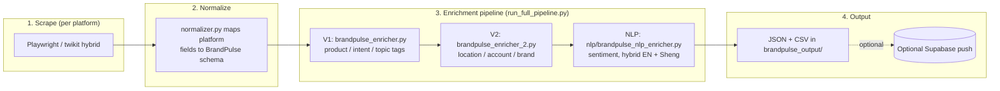

# Architecture

BrandPulse is five independent scrapers — one per social platform — that each
funnel into the same enrichment pipeline shape. There is no shared installed
package: each scraper has its own copy of the enrichment and NLP code. This
is a real limitation, not a design choice — see [Known duplication](#known-duplication-not-a-shared-package)
below.

## Per-platform access strategy

None of these platforms offer a public API that covers this use case
affordably, so each scraper reverse-engineers browser-based access instead.

| Platform | Access method | Auth |
|---|---|---|
| X (Twitter) | `twikit` for login/session only; actual tweet discovery + enrichment via Playwright browser automation (`x_playwright_scraper.py`) | Username/password → session cached in `cookies.json` |
| Instagram | Playwright, `launch_persistent_context` | Manually logged-in Chrome-for-Testing profile |
| Facebook | Playwright against `mbasic.facebook.com` (lighter markup) + GraphQL comment pagination | Same persistent Chrome-for-Testing profile |
| LinkedIn | Playwright against LinkedIn's internal Voyager API | Same persistent Chrome-for-Testing profile |
| TikTok | Playwright | Same persistent Chrome-for-Testing profile |

The persistent-profile approach (log in once by hand, reuse the cookie store
indefinitely) was chosen over programmatic login for Instagram/Facebook/
LinkedIn/TikTok specifically to avoid tripping 2FA and automated-login
detection, which is far more aggressive than in-session bot detection on
these platforms.

Instagram's scraper is mid-migration from Selenium to Playwright: the
extraction methods are written against a Selenium-shaped API
(`find_element`, `get_attribute`, `.click()`), and `instagram_scraper_python.py`
wraps the real Playwright `Locator`/`Page` objects in `PlaywrightElementShim`/
`PlaywrightDriverShim` classes that expose that same surface. That's why the
extraction logic reads like Selenium even though Playwright is what's
actually driving the browser.

## Scrape → enrich pipeline



## BrandPulse schema

The common shape every normalizer maps its platform's native fields into,
and what the enrichers expect as input:

| Field | Meaning |
|---|---|
| `caption` | Post text / tweet text / video description |
| `username` | Author's platform handle |
| `follower_count` | Author's follower count at scrape time |
| `likes_count` | Post like count |
| `comment_texts` | List of collected comment strings |
| `hashtags` | Extracted hashtags |
| `mentions` | Extracted @mentions |
| `post_url` | Canonical URL to the post |
| `platform` | One of `x`, `instagram`, `facebook`, `linkedin`, `tiktok` |

## Hybrid trilingual NLP

```mermaid
flowchart TB
    A[Post text] --> B{langdetect\n(skipped for X —\nX's API pre-detects language)}
    B -->|English| C[Google Cloud\nNatural Language API]
    B -->|Swahili / Sheng| D[HuggingFace AfriSenti\nmodel, runs locally]
    C --> E[Sentiment + entities]
    D --> E
```

English routes to Google Cloud NLP; Swahili and Sheng (the Nairobi
English-Swahili code-switch common in Kenyan social media) route to a
locally-run HuggingFace AfriSenti model instead, since general-purpose
cloud NLP APIs handle Sheng poorly. This is the one piece of the pipeline
that's genuinely tuned to the Kenyan market rather than being generic
social-listening plumbing.

## Geolocation fusion (Instagram only)

`InstagramScraper/instagram_scraper_python.py`'s `GeoLocationEnricher` fuses
up to 8 independent signals into one confidence-scored `GeoResult` when a
post has no native location tag:

1. Caption text analysis
2. Hashtag analysis
3. Profile metadata
4. Post timing analysis (posting-hour heuristics)
5. Image EXIF metadata
6. Visual content recognition — **optional**, uses Claude Vision on the post
   image; skipped silently if `ANTHROPIC_API_KEY` isn't set
7. IP/network analysis
8. Username analysis

Each method returns zero or more weighted `GeoSignal`s; the enricher fuses
them into a single best-guess location and confidence score.

## Known duplication (not a shared package)

`brandpulse_enricher.py`, `brandpulse_enricher_2.py`, and the `nlp/` package
are byte-for-byte duplicated across XScraper, InstagramScraper, and
TiktokScraper rather than factored into one shared package that each
scraper imports. Each platform was built as a sequential, independent
freelance deliverable rather than one coordinated build, which is how the
duplication happened — it's debt, not a design decision.

## Dead code encountered during this audit

- `XScraper/run_scraper.py` was deleted — it referenced `run_full_scrape()`
  and `normalize_batch()`, neither of which exist anywhere in the codebase.
  `run_x_pipeline.py` is the real, current entry point.
- `InstagramScraper/run_scraper.py` had a hardcoded (and unused —
  `InstagramScraperEnhanced` ignores its `cookies` argument) Instagram
  session cookie left over from before the scraper switched to the
  persistent-profile approach. Removed.
- `TiktokScraper/.env` referenced `TIKTOK_MS_TOKEN` and `TWITTER_ACCOUNTS`,
  neither of which is read anywhere in the current scraper — leftover from
  an earlier `TikTokApi`/`twscrape`-based design before it moved to
  Playwright + persistent profile, same as Facebook/LinkedIn.
